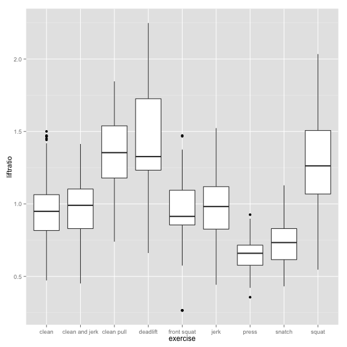
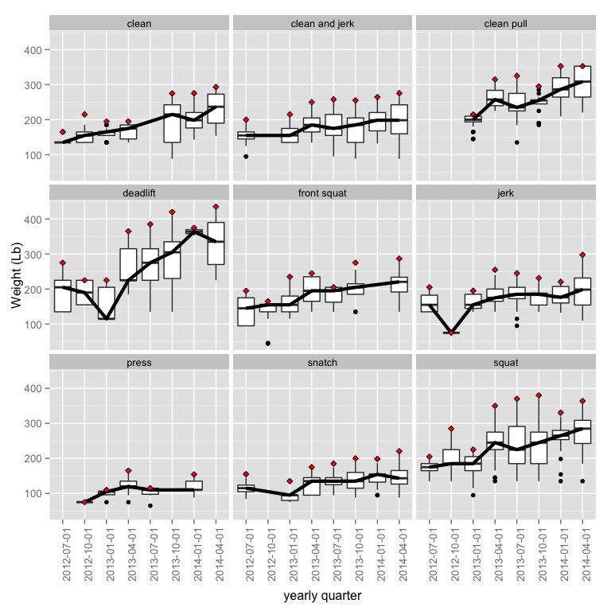
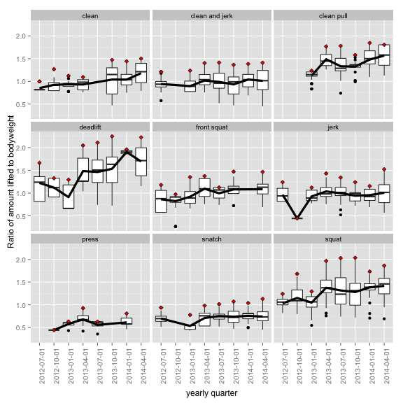

# Weightlifting Is Fun

I wrote [this](http://aarongonzales.net/2014/08/blackboxfitness/) a while ago and thought i'd post this data i've been keeping for a while. Using a combination of [Fitocracy](http://www.fitocracy.com/profile/aaron_gonzales/) and manual tracking, I've managed to log nearly every rep of every training session i've had for the last several years. 

## methods
### Getting Data
Getting the data from Fitocracy was the only real chore. At the time of my acquisition (Feb. 2014), their API didn't allow direct export of the data to any reasonable format, so I downloaded each individual relevant file from the Performance tab in my profile page. Some regular expressions reshaped the data a bit from this:

* "Activity","Date (YYYYMMDD)","Set",,"unit",,"unit","Combined","Points"
* "Clean and Jerk",2012-08-23,3301,125,,3,,"125 lb || 3 reps","80"

to this:

* date, exercise, weight, units, reps, quarters, bodyweight, liftratio, totalweightperset
* 2012-08-23, clean and jerk, 125, lb, 3, 2012-07-01, 165.3, 0.7562008, 375

as i didn't need the "Points" category and the activity names were cleaned a bit. 

Otherwise, R was used for this post. 
### Libraries used for this post:

```r
library(lubridate)
library(ggplot2)
library(plyr)
```

### Reading and chopping up the data in R.

Lubridate is awesome. 

```r
lifting <- read.csv("/dropbox/stats/weightlifting/liftinglog.csv", header=TRUE)
# lifting <- read.csv("/analysis/googledrive/liftinglog.csv", header=TRUE)
# lifting$date <- ymd(lifting$date)
lifting$date <- mdy(lifting$date)
lifting$exercise <- as.character(lifting$exercise)
lifting$exercise <- gsub("barbell ", "", lifting$exercise)
lifting$exercise <- as.factor(lifting$exercise)
# lifting <- lifting[,-7]
kg <- subset(lifting, subset = units=="kg")
lb <- subset(lifting, subset = units=="lb")
kg$weight <- kg$weight * 2.20462
kg$units <- "lb"

lifting <- rbind(lb,kg)

lifting <- subset(lifting, subset=exercise != "power snatch") 
lifting <- subset(lifting, subset=exercise != "power clean") 
# lifting <- subset(lifting, subset=exercise != "front squat") 
lifting <- droplevels(lifting)
```
I dropped the power version of the snatch and clean due to inconsistent logging on my part.

Adding date ranges by quarters for group the lifts by a three-month period.

```r
lifting$quarters <- cut(lifting$date, breaks="quarter")
labs <- paste(substr(levels(lifting$quarters),1,4),"/",1:4, sep="")
lifting$quarters <- factor(lifting$quarters) 
```

Adding in my bodyweight and a ratio of lift:bodyweight. The bodyweight is accurate roughly to 1.5 lb. 

```r
lifting <- ddply( lifting, .(quarters), transform, bodyweight=161 + (4.3*as.numeric(quarters)))
lifting$liftratio <- lifting$weight / lifting$bodyweight
range(lifting$bodyweight)
```

```
## [1] 165.3 195.4
```

```r
range(lifting$liftratio)
```

```
## [1] 0.2653 2.2484
```


I also added in weight moved per set, mostly because it's kind-of cool

```r
lifting <- ddply( lifting, .(quarters), transform, totalweightperset= weight*reps)
```


## "Results" - or something like that.
### Pretty pretty plots
The following plot shows boxplots the ratio of lift:bodyweight number. Clearly, the deadlift and squat have the higher ratios here, as this make plenty of biomechanical sense. I don't train the trational deadlift very often anymore and i think that's why it's so skewed.

```r
p <- ggplot(lifting, aes(exercise, liftratio))
p <- p + geom_boxplot()
print(p)
# p + geom_violin()
```




This next two plots are similar. Both show a similar thing - boxplots of 
weight moved or liftratio broken up by yearly quarter to show how they 
have changed over time. The red diamond denotes the highest value for the 
quarter and it's interesting to see some are considered outliers for that time period. 
The black line connects the mean value over time (the line in the boxes denotes the median). 
As I started maxing out my lifts more regularly over the last 9 months and stopped 
doing sets that had high volume (no more Crossfit for me) I have had more accurate numbers, perhpas.  


```r
p <- ggplot(lifting, aes(quarters, weight))
p <- p + geom_boxplot()
p <- p + stat_summary(aes(group=exercise), fun.y=median, geom="line", size=1.5)
p <- p + stat_summary(aes(group=exercise), fun.y=max, geom="point", size=2, shape=23, fill="red")
p <- p + facet_wrap(~ exercise)
p <- p + labs(
    # title omitted; letting rmarkdown handle it
#     title="Major lifts progression over time, by quarter  
#               red diamond is the best lift for the quarter, black line is median
#               weight lifted for the quarter. This includes
#               warm up weights.", 
              y = "Weight (Lb)", 
              x="yearly quarter")
p <- p + theme(text = element_text(size=12),
        axis.text.x = element_text(angle=90, vjust=1, size=10),
        axis.text.y = element_text(size=10))
print(p)
p_2 <- ggplot(lifting, aes(quarters, liftratio))
p_2 <- p_2 + geom_boxplot()
# p_2 <- p_2 + stat_summary(aes(group=exercise), fun.y=median, geom="line", size=2)
p_2 <- p_2 + stat_summary(aes(group=exercise), fun.y=mean, geom="line", size=1.5)
p_2 <- p_2 + stat_summary(aes(group=exercise), fun.y=max, geom="point", size=2, shape=23, fill="red")
p_2 <- p_2 + facet_wrap(~ exercise)
p_2 <- p_2 + labs(
#     title="Major lifts progression over time, by quarter  
#               red diamond is the best lift for the quarter, black line is median
#               weight lifted for the quarter. This includes
#               warm up weights.", 
              y = "Ratio of amount lifted to bodyweight", 
              x="yearly quarter")
p_2 <- p_2 + theme(text = element_text(size=12),
        axis.text.x = element_text(angle=90, vjust=1, size=10),
        axis.text.y = element_text(size=10))
print(p_2)
# library(gridExtra)
# grid.arrange(p, p_2, ncol=2, main="Weightlifting Progression by quarters")
```



I like seeing that overall, it's clear that i'm getting stronger, both in pounds moved and in the ratio of pounds moved to bodyweight (though not so great in the overhead or olympic lifts as much, but i suppose that's expected. ) I should probably train my front squat a bit more and perhaps track other lifts, like overhead squats or snatch assistance movements. 

### I've lifted almost two million pounds in two years

```r
sum(lifting$totalweightperset)
```
...Which is a cool thing.

```
## [1] 1851664
```

Weightlifting is fun. 
