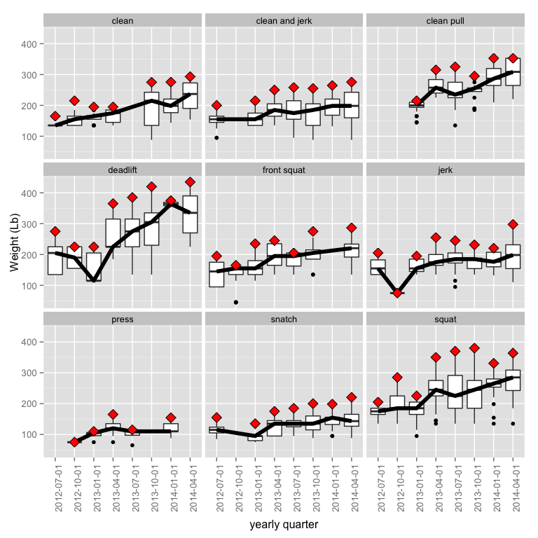

# weightlifting


Libraries used for this post:

```r
library(lubridate)
library(ggplot2)
library(plyr)
```

```
## 
## Attaching package: 'plyr'
## 
## The following object is masked from 'package:lubridate':
## 
##     here
```

Reading and chopping up the data

```r
lifting <- read.csv("/dropbox/stats/weightlifting/liftinglog.csv", header=TRUE)
# lifting <- read.csv("/analysis/googledrive/liftinglog.csv", header=TRUE)
# lifting$date <- ymd(lifting$date)
lifting$date <- mdy(lifting$date)
lifting$exercise <- as.character(lifting$exercise)
lifting$exercise <- gsub("barbell ", "", lifting$exercise)
lifting$exercise <- as.factor(lifting$exercise)
# lifting <- lifting[,-7]
kg <- subset(lifting, subset = units=="kg")
lb <- subset(lifting, subset = units=="lb")
kg$weight <- kg$weight * 2.20462
kg$units <- "lb"

lifting <- rbind(lb,kg)

lifting <- subset(lifting, subset=exercise != "power snatch") 
lifting <- subset(lifting, subset=exercise != "power clean") 
# lifting <- subset(lifting, subset=exercise != "front squat") 
lifting <- droplevels(lifting)


str(lifting)
```

```
## 'data.frame':	3488 obs. of  5 variables:
##  $ date    : POSIXct, format: "2012-08-23" "2012-08-23" ...
##  $ exercise: Factor w/ 9 levels "clean","clean and jerk",..: 2 2 2 2 2 2 2 2 2 2 ...
##  $ weight  : num  125 135 145 155 165 125 135 145 155 165 ...
##  $ units   : Factor w/ 1 level "lb": 1 1 1 1 1 1 1 1 1 1 ...
##  $ reps    : int  3 2 2 2 1 3 2 2 2 1 ...
```

Adding date ranges by quarters for binning the lifts

```r
lifting$quarters <- cut(lifting$date, breaks="quarter")
labs <- paste(substr(levels(lifting$quarters),1,4),"/",1:4, sep="")
lifting$quarters <- factor(lifting$quarters) 
```

Adding in bodyweight and a ratio of lift:bodyweight

```r
lifting <- ddply( lifting, .(quarters), transform, bodyweight=161 + (4.3*as.numeric(quarters)))
lifting$liftratio <- lifting$weight / lifting$bodyweight
range(lifting$bodyweight)
```

```
## [1] 165.3 195.4
```

```r
range(lifting$liftratio)
```

```
## [1] 0.2653 2.2484
```


Adding in weight moved per set:

```r
lifting <- ddply( lifting, .(quarters), transform, totalweightperset= weight*reps)
sum(lifting$totalweightperset)
```

```
## [1] 1851664
```

```r
fivenum(lifting$totalweightperset)
```

```
## [1]   88.18  264.55  410.00  675.00 4050.00
```


Plots 1

```r
p <- ggplot(lifting, aes(exercise, liftratio))
p + geom_boxplot()
p + geom_violin()
```


```r
p <- ggplot(lifting, aes(quarters, weight))
p <- p + geom_boxplot()
p <- p + stat_summary(aes(group=exercise), fun.y=median, geom="line", size=2)
p <- p + stat_summary(aes(group=exercise), fun.y=max, geom="point", size=4, shape=23, fill="red")
p <- p + facet_wrap(~ exercise)
p <- p + labs(
#     title="Major lifts progression over time, by quarter  
#               red diamond is the best lift for the quarter, black line is median
#               weight lifted for the quarter. This includes
#               warm up weights.", 
              y = "Weight (Lb)", 
              x="yearly quarter")
p <- p + theme(text = element_text(size=12),
        axis.text.x = element_text(angle=90, vjust=1, size=10),
        axis.text.y = element_text(size=10))
print(p)
```




```r
p <- ggplot(lifting, aes(quarters, liftratio))
p <- p + geom_boxplot()
# p <- p + stat_summary(aes(group=exercise), fun.y=median, geom="line", size=2)
p <- p + stat_summary(aes(group=exercise), fun.y=mean, geom="line", size=2)
# p <- p + stat_summary(aes(group=exercise), fun.y=max, geom="point", size=4, shape=23, fill="red")
p <- p + facet_wrap(~ exercise)
p <- p + labs(
#     title="Major lifts progression over time, by quarter  
#               red diamond is the best lift for the quarter, black line is median
#               weight lifted for the quarter. This includes
#               warm up weights.", 
              y = "Ratio of amount lifted to bodyweight", 
              x="yearly quarter")
p <- p + theme(text = element_text(size=12),
        axis.text.x = element_text(angle=90, vjust=1, size=10),
        axis.text.y = element_text(size=10))
print(p)
```


